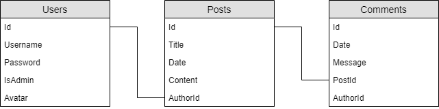
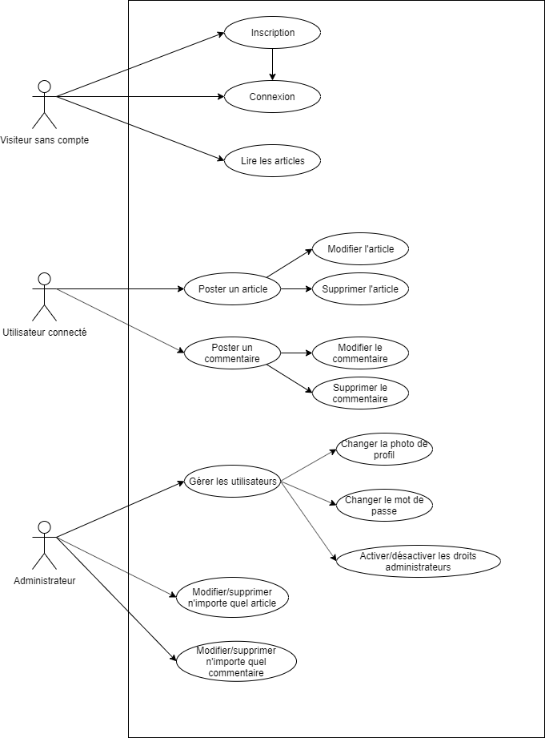

# Blog - Module 326 + 151 (Backend)

Pour lancer le projet, exécuter la commande : ```dotnet run``` (pas besoin de rebuild la db, elle est inclue)

La page Swagger sera accessible à cette adresse : https://localhost:5001/swagger/index.html

Il est possible que vous deviez autoriser la connexion à cause du certificat SSL invalide.

## Les tests

Pour lancer les tests, exécuter la commande : ```dotnet test```

Il y a environ une dixaine de tests. Uniquement pour le controlleur User.

## Diagrammes
### MLD

### Use case


Burkhalter Yannis INFO3E (2021)
